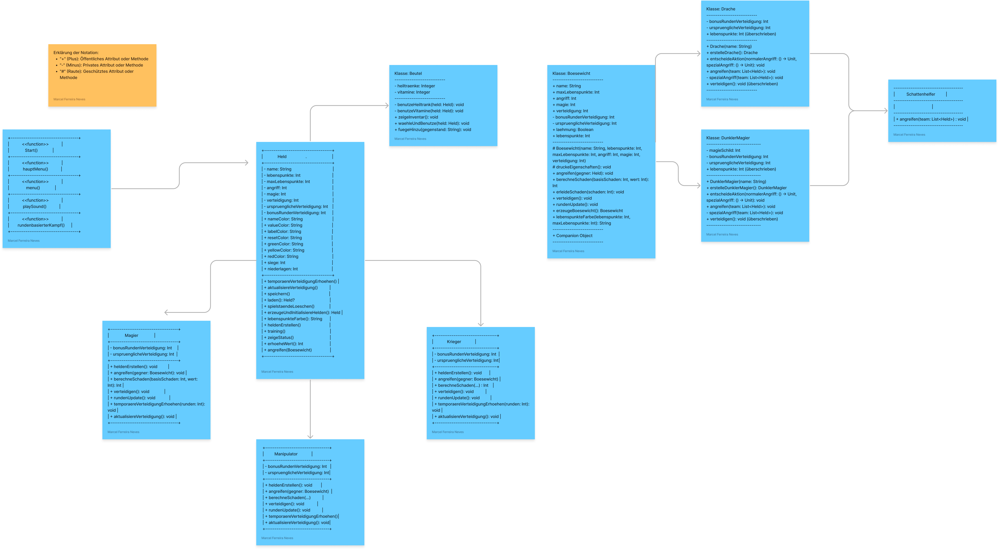

# Abenteuerspiel

Das Abenteuerspiel ist ein in Kotlin geschriebenes textbasiertes Spiel. Die Spieler können zwischen Einzelmodus und Teammodus wählen, ihren Helden trainieren, gegen Bösewichte kämpfen und ihre Spielstände verwalten.

## Features

- Einzel- und Teammodus für Kämpfe
- Rundenbasierter Kampfmechanismus
- Trainingsmodus für den Helden
- Spielstände speichern und laden
- Dynamische Ereignisse basierend auf Spielerentscheidungen

## Starten des Spiels

Das Spiel beginnt mit einer Begrüßungsnachricht und Optionen für den Spieler, entweder den Einzelmodus oder den Teammodus auszuwählen. Die Spiellogik navigiert dann entsprechend weiter.

## Hauptmenü

Im Hauptmenü kann der Spieler wählen, ob er:

- Ein neues Spiel starten
- Ein gespeichertes Spiel laden
- Einen Spielstand löschen möchte

Abhängig von der Wahl des Spielers werden unterschiedliche Aktionen durchgeführt.

## Kämpfen

Im Kampf kann der GuteSeite.Held:

- Angreifen
- Verteidigen
- Gegenstände aus dem Items.Beutel verwenden

Die Kämpfe sind rundenbasiert, und der Fortschritt des Spielers wird durch die Anzahl der Siege und Niederlagen festgehalten.

## Sound-Effekte

Das Spiel beinhaltet eine Funktion, um Sound-Dateien abzuspielen. Diese kann genutzt werden, um das Spielerlebnis mit akustischen Effekten zu bereichern.

## Verwendung

Zum Spielen das Spiel ausführen und den Anweisungen in der Konsole folgen. Es werden verschiedene Optionen angeboten, zwischen denen der Spieler wählen kann, um das Spiel zu steuern.

Das Items.Beutel-Verwaltungssystem ist eine einfache Klasse, die in Rollenspielen eingesetzt werden kann, um das Inventar eines Helden zu verwalten. Es ermöglicht dem Helden, Heiltränke und Vitamine zu verwenden und zu verwalten.
# Items.Beutel-Verwaltungssystem

## Funktionen

### Heiltrank verwenden

- Ein GuteSeite.Held kann einen Heiltrank aus seinem Items.Beutel verwenden, um seine Lebenspunkte um 30% seiner maximalen Lebenspunkte zu heilen.
- Es kann nur verwendet werden, wenn der GuteSeite.Held noch Heiltränke in seinem Items.Beutel hat.

### Vitamine verwenden

- Ein GuteSeite.Held kann Vitamine verwenden, um seine temporäre Verteidigung für die nächsten 3 Runden um 20% zu erhöhen.
- Es kann nur verwendet werden, wenn der GuteSeite.Held noch Vitamine in seinem Items.Beutel hat.

### Inventar anzeigen

- Zeigt die Anzahl der Heiltränke und Vitamine im Items.Beutel des Helden an.

### Gegenstand verwenden

- Ermöglicht dem Spieler, einen Gegenstand aus dem Items.Beutel zu wählen und zu verwenden.
- Der Spieler muss zwischen "1" für Heiltrank und "2" für Vitamine wählen, ansonsten verliert der Spieler die Aktion.

### Gegenstand hinzufügen

- Fügt einen Heiltrank oder Vitamine zum Items.Beutel hinzu, wenn der entsprechende Gegenstand gewählt wird.

## Klasse: BoeseSeite.Boesewicht

Die `BoeseSeite.Boesewicht`-Klasse ist eine offene Klasse, die erweitert werden kann, um verschiedene Arten von Bösewichten zu erstellen. Sie verfügt über Attribute zur Verwaltung von Lebenspunkten, Angriff, Magie und Verteidigung.

### Eigenschaften

- `name`: Der Name des Bösewichts (konstant).
- `lebenspunkte`: Aktuelle Lebenspunkte, nicht weniger als 0.
- `maxLebenspunkte`: Maximale Lebenspunkte.
- `angriff`: Wert des Angriffs.
- `magie`: Magiewert für magische Angriffe.
- `verteidigung`: Wert der Verteidigung.

### Methoden

- `druckeEigenschaften()`: Druckt die Eigenschaften des Bösewichts aus.
- `angreifen(gegner: GuteSeite.Held)`: Führt einen Angriff gegen einen Helden aus.
- `berechneSchaden(basisSchaden: Int, wert: Int)`: Berechnet den Schaden basierend auf dem Basis-Schaden und dem Angriffs- oder Magiewert.
- `erleideSchaden(schaden: Int)`: Reduziert die Lebenspunkte des Bösewichts, wenn Schaden erlitten wird.
- `verteidigen()`: Erhöht die Verteidigung für eine bestimmte Anzahl von Runden.
- `rundenUpdate()`: Aktualisiert den Zustand nach jeder Runde.

# BoeseSeite.Drache-Klasse

## Beschreibung
Die `BoeseSeite.Drache`-Klasse ist eine spezialisierte Implementierung eines Bösewichts in einem Spiel, das Rollenspielelemente enthält. Diese Klasse erbt von der `BoeseSeite.Boesewicht`-Basisklasse und fügt spezifische Merkmale und Verhaltensweisen eines Drachens hinzu, wie spezielle Angriffe und Verteidigungsmechanismen.

## Features
- **Erstellung eines Drachen:** Die Klasse bietet eine `companion object`-Factory-Methode `erstelleDrache`, die eine Instanz von `BoeseSeite.Drache` mit einem vordefinierten Namen erstellt.
- **Angriffsentscheidung:** Der BoeseSeite.Drache kann zwischen normalen und speziellen Angriffen wählen.
- **Spezialangriff:** Der BoeseSeite.Drache kann einen mächtigen Flächenangriff ausführen, der alle Helden im Team trifft.
- **Verteidigung:** Der BoeseSeite.Drache kann seine Verteidigung mit einem Bonus für eine bestimmte Anzahl von Runden erhöhen.

# Dunkler GuteSeite.Magier Klasse

Die `BoeseSeite.DunklerMagier`-Klasse ist eine spezialisierte Unterklasse von `BoeseSeite.Boesewicht`, die in einem Fantasy-Rollenspiel verwendet wird. Ein `BoeseSeite.DunklerMagier` ist ein mächtiger Gegner, der spezielle magische Angriffe und Verteidigungsfähigkeiten besitzt.

## Features

- **Magischer Schild:** Der `BoeseSeite.DunklerMagier` kann einen magischen Schild aktivieren, der zusätzlichen Schutz bietet.
- **Spezialangriff:** Zusätzlich zu normalen magischen Angriffen kann der `BoeseSeite.DunklerMagier` einen mächtigen speziellen Angriff ausführen, der das gesamte Helden-Team betrifft.
- **Aktionen Entscheiden:** Der `BoeseSeite.DunklerMagier` kann strategisch zwischen normalen und speziellen Angriffen basierend auf einer Zufallsentscheidung wählen.

## Klassen
- `GuteSeite.Held`: Die Basisklasse für Helden-Objekte mit Eigenschaften wie Name, Lebenspunkte, Angriff, Magie und Verteidigung.

## Funktionen
- `temporaereVerteidigungErhoehen(int runden)`: Erhöht temporär die Verteidigung des Helden.
- `aktualisiereVerteidigung()`: Aktualisiert die Verteidigung des Helden nach dem Ablauf von Bonus-Runden.
- `speichern()`: Speichert den aktuellen Zustand des Helden in eine Datei.
- `laden()`: Lädt einen Helden aus einer gespeicherten Datei.
- `spielstaendeLoeschen()`: Löscht vorhandene Spielstände.
- `erzeugeUndInitialisiereHelden()`: Erstellt und initialisiert einen neuen Helden.
- `heldenErstellen()`: Erzeugt einen Helden mit zufälligem Namen und Eigenschaften.
- `training()`: Ermöglicht es dem Helden, seine Fähigkeiten zu trainieren.
- `zeigeStatus()`: Zeigt den aktuellen Status des Helden an.
- `angreifen(BoeseSeite.Boesewicht gegner)`: Stellt den Angriff auf einen Bösewicht dar.

## Start des Spiels
Um das Spiel zu starten, kann die Methode `erzeugeUndInitialisiereHelden()` verwendet werden, um einen neuen Helden zu erzeugen und mit dem Spiel zu beginnen.

## Speichern und Laden
Das Spiel bietet die Möglichkeit, den Fortschritt zu speichern und zu einem späteren Zeitpunkt wieder zu laden. Dies wird durch die Methoden `speichern()` und `laden()` ermöglicht.

## Training
Spieler können ihre Fähigkeiten verbessern, indem sie die Methode `training()` verwenden, welche interaktive Optionen zum Trainieren bietet.

# GuteSeite.Krieger Klasse

Die `GuteSeite.Krieger`-Klasse ist eine Erweiterung der `GuteSeite.Held`-Klasse und repräsentiert einen mutigen und starken GuteSeite.Krieger in einem Fantasy-Rollenspiel.

## Eigenschaften

- `name`: Der Name des Kriegers, welcher aus einer Liste von heroischen Titeln und Vornamen generiert wird.
- `lebenspunkte`: Die aktuellen Gesundheitspunkte des Kriegers.
- `maxLebenspunkte`: Die maximalen Gesundheitspunkte, die der GuteSeite.Krieger haben kann.
- `angriff`: Die Angriffskraft des Kriegers, die in Kampfhandlungen verwendet wird.
- `magie`: Der magische Wert des Kriegers, der seine magischen Fähigkeiten widerspiegelt.
- `verteidigung`: Die Fähigkeit des Kriegers, eingehenden Schaden zu reduzieren.

## Methoden

- `heldenErstellen()`: Generiert einen neuen GuteSeite.Krieger mit einem einzigartigen Namen und setzt alle Attribute auf Standardwerte für den Beginn des Spiels.
- `angreifen(gegner: BoeseSeite.Boesewicht)`: Ermöglicht es dem GuteSeite.Krieger, einen Gegner anzugreifen und Schaden zu verursachen.
- `berechneSchaden(basisSchaden: Int, wert: Int)`: Berechnet den Schaden basierend auf dem Basiswert und einem Angriffs- oder Verteidigungswert.
- `verteidigen()`: Erhöht temporär die Verteidigung des Kriegers, wenn er sich verteidigt.
- `rundenUpdate()`: Aktualisiert den Status des Kriegers am Ende jeder Runde.
- `temporaereVerteidigungErhoehen(runden: Int)`: Erhöht die Verteidigung des Kriegers temporär für eine bestimmte Anzahl von Runden.
- `aktualisiereVerteidigung()`: Aktualisiert die Verteidigung des Kriegers nach dem Auslaufen des temporären Verteidigungsbuffs.

# GuteSeite.Magier Klasse

Dieses Repository enthält eine Implementierung einer `GuteSeite.Magier`-Klasse in Kotlin, die von der abstrakten Klasse `GuteSeite.Held` erbt. Der `GuteSeite.Magier` ist eine spezialisierte Charakterklasse mit Fähigkeiten für magische Angriffe und Verteidigung.

## Funktionalitäten

- Erstellung eines GuteSeite.Magier-Helden mit einem zufälligen Namen und speziellen Titeln.
- Möglichkeit, einen Gegner mit verschiedenen magischen Angriffen anzugreifen.
- Verteidigung verstärken durch Schutzzauber.
- Rundenbasiertes Update für temporäre Verteidigung.

## Methoden

- `heldenErstellen()`: Erstellt einen neuen Helden mit vordefinierten Werten für Lebenspunkte, Angriff, Magie und Verteidigung.
- `angreifen(gegner: BoeseSeite.Boesewicht)`: Führt einen Angriff auf den Gegner aus und berechnet den verursachten Schaden basierend auf der gewählten magischen Attacke.
- `verteidigen()`: Verstärkt die Verteidigung des Magiers temporär.
- `rundenUpdate()`: Aktualisiert die Verteidigungsboni und -effekte nach jeder Runde.
- `temporaereVerteidigungErhoehen(runden: Int)`: Erhöht die Verteidigung temporär für eine bestimmte Anzahl von Runden.
- `aktualisiereVerteidigung()`: Setzt die Verteidigungswerte nach dem Ablauf von Bonus-Effekten zurück.

# Helden-GuteSeite.Manipulator

Der `GuteSeite.Manipulator` ist eine spezialisierte Klasse in einem fiktiven Spiel, welche die Fähigkeiten und Charakteristika eines spielbaren Helden definiert. Diese Klasse erweitert die Basisklasse `GuteSeite.Held` und bietet maßgeschneiderte Funktionalitäten für Charaktere, die auf Manipulation und Kontrolle spezialisiert sind.

## Eigenschaften

Die `GuteSeite.Manipulator`-Klasse hat folgende Eigenschaften:

- `name`: Der Name des Helden.
- `lebenspunkte`: Die aktuellen Lebenspunkte des Helden.
- `maxLebenspunkte`: Die maximalen Lebenspunkte des Helden.
- `angriff`: Die Angriffskraft des Helden.
- `magie`: Die magischen Fähigkeiten des Helden.
- `verteidigung`: Die Verteidigungsfähigkeit des Helden.

## Methoden

Die `GuteSeite.Manipulator`-Klasse bietet spezielle Methoden:

- `heldenErstellen()`: Initialisiert den Helden mit einem einzigartigen Namen und Standardattributen.
- `angreifen(gegner: BoeseSeite.Boesewicht)`: Ermöglicht es dem Helden, einen Gegner anzugreifen, wobei verschiedene manipulative Fähigkeiten genutzt werden können.
- `verteidigen()`: Erhöht temporär die Verteidigung des Helden.
- `rundenUpdate()`: Aktualisiert den Status des Helden am Ende jeder Runde, z.B. die Verringerung temporärer Buffs.
- `temporaereVerteidigungErhoehen(runden: Int)`: Erhöht die Verteidigung des Helden temporär für eine bestimmte Anzahl von Runden.
- `aktualisiereVerteidigung()`: Aktualisiert die Verteidigungswerte des Helden, sobald temporäre Effekte abgelaufen sind.

# BoeseSeite.Schattenhelfer

## Beschreibung

`BoeseSeite.Schattenhelfer` ist eine Unterstützungseinheit im Spiel, die konstanten Schaden an einem Team von Helden verursacht. Bei jedem Angriff verringert der BoeseSeite.Schattenhelfer die Lebenspunkte aller Helden im Team.

## Funktionen

### angreifen(team: List<GuteSeite.Held>)

- Diese Methode nimmt eine Liste von Helden (`team`) als Argument.
- Jeder GuteSeite.Held im übergebenen Team erleidet 10 Schadenspunkte.
- Der Schaden wird direkt von den `lebenspunkte` jedes Helden abgezogen.
- Die Methode gibt für jeden angegriffenen Helden eine Nachricht auf der Konsole aus, die den verursachten Schaden anzeigt.
